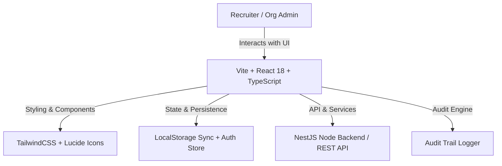

# Clyptus Software Solution — Recruiter Portal & ATS System Documentation

> **Version**: 2.0.0  
> **Platform**: Clyptus Talent Acquisition & Recruiter Portal  
> **Target Roles**: Organization Admin, HR Recruiters, Hiring Managers, Tech Recruiters  

---

## 1. Executive Summary

**Clyptus Recruiter Portal** is an enterprise-grade Applicant Tracking System (ATS) and AI Candidate Sourcing platform designed for high-efficiency recruitment workflows. It empowers Organization Admins and Recruiters to source verified talent using multi-criteria AI filtering, manage job requisitions, allocate recruiter token balances, track candidate application pipelines, monitor operational recruitment metrics, and audit system activities.

---

## 2. Platform Architecture & Tech Stack



### Technology Core:
- **Frontend Framework**: React 18 with TypeScript & Vite
- **UI & Styling**: TailwindCSS, Vanilla CSS tokens, Lucide React Icon suite
- **State & Storage**: React Hooks (`useState`, `useEffect`), Custom Auth Store (`useAuthStore`), LocalStorage Event Synchronizer
- **Routing**: React Router v6
- **Build System**: Vite build pipeline (`tsc && vite build`)

---

## 3. Core Feature Modules

### 3.1 Candidate Search & AI Talent Sourcing (`CandidateSearch.tsx`)

The **Candidate Search** section allows recruiters to query a verified dataset of candidate profiles based on 11 distinct recruitment criteria.

```
+-----------------------------------------------------------------------------------+
| ✨ Find the right candidates with AI                            🌐 India ∨ [650 Tkn]|
| [ Search form ]  [ Search by Job Description ]  [ 🔖 Saved Profiles (2) ]          |
+-----------------------------------------------------------------------------------+
| Card 1: Keywords & Experience & Location                                          |
| - Mandatory / Optional Keyword Tags with Star toggles (e.g. ⭐ ai, ⭐ frontend)    |
| - Exclude Synonyms & Exclude Keywords                                             |
| - Minimum & Maximum Experience Dropdowns (Years + Months)                         |
| - Current Location Input + Relocation Willingness + Preferred Locations           |
+-----------------------------------------------------------------------------------+
| Card 2: Annual Salary & Notice Period                                             |
| - Annual Salary Minimum & Maximum Dropdowns (Lacs / $ k)                          |
| - Notice Period Pills (Immediate, 30 days, 45 days, 60 days, 90 days, Any)       |
| - Radio Selection: Without Notice Period vs Serving Notice Period                 |
+-----------------------------------------------------------------------------------+
| Card 3: Education & Employment Details                                            |
| - Under Graduation (Any UG, Specific UG, No UG) & Post Graduation (Any PG, etc.)   |
| - Industry & Company Name Filters                                                 |
+-----------------------------------------------------------------------------------+
| Card 4: Demographics, Visa Status & Age                                           |
| - Gender Pills, Differently Abled Filters, Languages Known                        |
| - Visa Status Pills (H1B, L1, Green Card, US Citizen, Authorized) & Age Dropdowns |
+-----------------------------------------------------------------------------------+
| Sticky Bottom Bar: [ In last 6 months ∨ ]                  [Clear All] [Search]  |
+-----------------------------------------------------------------------------------+
```

#### Key Capabilities & Button Workflows:
1. **Mandatory Keyword Tags**:
   - Clicking the star icon (`⭐`) toggles whether a keyword is **Mandatory**. Candidates must match all mandatory keywords.
   - Hovering over a mandatory star displays an interactive tooltip: *"This keyword is marked as 'Mandatory'"*.
2. **Search by Job Description (AI Extractor)**:
   - Recruiters can paste a raw Job Description text. The AI engine automatically parses 5 core target skills and populates the form filters.
3. **Candidate Profile Drawer (1 Token)**:
   - Clicking any candidate card deducts 1 token from the organization balance and opens a comprehensive profile drawer.
   - Automatically records the candidate in the **Previously Viewed History** sidebar drawer.
4. **Verified Resume Download (2 Tokens)**:
   - Clicking **Download Resume** deducts 2 tokens and generates a downloadable structured `.txt` candidate resume file.
5. **Save & Shortlist Profile**:
   - **Bookmark (`🔖`)**: Saves profile to the `Saved Profiles` tab where candidates can be searched directly by name.
   - **Shortlist (`UserCheck`)**: Toggles candidate status to shortlisted for active positions.
6. **Direct Candidate Messaging**:
   - Opens a contact modal allowing recruiters to dispatch direct interview invitation emails.

---

### 3.2 Recruiter Management & Credential Authorization (`Members.tsx`)

Organization Admins manage recruiters, assign job requisitions, allocate token quotas, and create recruiter login credentials.

#### Features & Workflow:
- **Credential Generation**: When adding a new recruiter, the Admin assigns an **Email** and **Password**.
- **Credential Display**: Opening a recruiter profile in `Members.tsx` displays their assigned login email and password font-monospaced.
- **Recruiter Sub-Types**: Supports `HR_RECRUITER`, `HIRING_MANAGER`, and `TECH_RECRUITER`.
- **Job & Workload Assignment**: Admin can assign active job requisitions to recruiters. Workload score (0-100%) auto-calculates based on opening count.
- **Real-Time Synchronization**: Any job assigned to a recruiter in `Members.tsx` or `Jobs.tsx` immediately syncs across both sections and updates the recruiter profile.

---

### 3.3 Job Openings Overview & Creation (`Jobs.tsx`)

The **Job Openings** module provides full lifecycle management for job requisitions.

#### Features & Workflow:
- **2-Column Layout Creation**:
  - **Left Column**: Posting category (`Permanent`, `Contract`, `Walk-in`), work type (`Full time`, `Part time`), schedule type, expiry date, and recruiter assignment.
  - **Right Column**: Job title, experience requirements, AI Job Description generator, compensation range, job location, and required skills.
- **10 Recommended Skills Dropdown**:
  - Includes a pre-populated dropdown select with 10 top technical skills:
    1. `React.js`
    2. `TypeScript`
    3. `Node.js`
    4. `Python`
    5. `Java / Spring Boot`
    6. `AWS Cloud`
    7. `Docker & Kubernetes`
    8. `SQL / PostgreSQL`
    9. `Figma / UI/UX Design`
    10. `DevOps & CI/CD`
  - Admins can select skills from the dropdown or type custom skill tags.
- **AI Content Generator**: Generates structured job descriptions and skill lists at the click of a button.

---

### 3.4 Recruitment Analytics & Operational Performance (`Analytics.tsx`)

Provides real-time recruitment telemetry for Admin decision-making.

#### Metrics Tracked:
- **Active Jobs Count**: Real-time count of active open requisitions.
- **Shortlisted Candidates**: Aggregate total across all active requisitions.
- **Avg Time-to-Hire**: Average days required to fill open positions (e.g. 18 days).
- **Interviews Conducted**: Total interviews held in selected period.
- **Token Consumption**: Total credits used for candidate profile unlocks and resume downloads.
- **Time Filter Controls**: Includes top bar date range filters (`30D`, `90D`, `6M`, `1Y`).

---

### 3.5 Audit Trail & Export (`Audit.tsx`)

Ensures complete governance and security compliance for all administrative actions.

#### Log Event Categories:
- `RECRUITER_ACTION`: Recruiter added, updated, suspended, direct messages sent.
- `JOB_ACTION`: Jobs created, updated, status toggled, recruiters assigned.
- `APPLICATION_CHANGE`: Candidate profiles unlocked, resumes downloaded.
- `ATS_TRANSITION`: Candidate status updates in pipeline.
- `TOKEN_ALLOCATION`: Tokens allocated to recruiters.
- `PERMISSION_CHANGE`: Recruiter job assignments modified.
- `SECURITY_EVENT`: Login attempts, credential changes.

#### Exporting Audit Log:
- Clicking **Export Audit Log** downloads a `.csv` file formatted with `Timestamp`, `Category`, `Title`, `Description`, and `User`.

---

## 4. Key Data Interfaces

```typescript
// Candidate Record Schema
export interface CandidateRecord {
  id: string;
  name: string;
  email: string;
  phone: string;
  jobRole: string;
  headline: string;
  location: string;
  relocateWilling: boolean;
  expectedSalary: number; // In LPA / $k
  workMode: 'Remote' | 'Hybrid' | 'Onsite';
  employmentType: 'Full-time' | 'Part-time' | 'Contract';
  noticePeriod: 'Immediate' | '15 Days' | '30 Days' | '60 Days' | '90 Days';
  profileStatus: 'Active' | 'Available' | 'Not Available';
  lastActive: 'Today' | 'This Week' | 'This Month' | '2 Months Ago';
  languages: string[];
  experienceYrs: number;
  summary: string;
  skills: string[];
  workHistory: Array<{ company: string; role: string; duration: string; highlights: string }>;
  education: { degree: string; institution: string; year: string };
  resumeFileName: string;
  ugDegree?: string;
  pgDegree?: string;
  visaStatus?: string;
  gender?: string;
  age?: number;
  industry?: string;
}

// Recruiter Profile Schema
export interface Recruiter {
  id: string;
  userId: string;
  name: string;
  email: string;
  password?: string;
  phone?: string;
  department?: string;
  role: string;
  recruiterType: 'HR_RECRUITER' | 'HIRING_MANAGER' | 'TECH_RECRUITER';
  status: 'ACTIVE' | 'SUSPENDED';
  tokenBalance: number;
  assignedJobsCount: number;
  assignedJobs: Array<{ id: string; title: string; department: string; status: string }>;
  workloadScore: number;
  joinDate: string;
  activities: Array<{ id: string; action: string; timestamp: string; details: string }>;
}

// Job Requisition Schema
export interface JobItem {
  id: string;
  title: string;
  department: string;
  location: string;
  employmentType: string;
  salaryMin?: number;
  salaryMax?: number;
  description: string;
  requiredSkills?: string[];
  status: 'PUBLISHED' | 'CLOSED' | 'DRAFT';
  assignedRecruiterId?: string;
  assignedRecruiterName?: string;
  applicationsCount: number;
  createdAt: string;
  analytics: {
    applied: number;
    shortlisted: number;
    interview: number;
    offered: number;
    hired: number;
    timeToFillDays: number;
    conversionRate: number;
  };
}
```

---

## 5. Setup, Build & Running Instructions

### Local Development:
```bash
# Navigate to project frontend directory
cd C:\Users\91728\.gemini\antigravity-ide\scratch\job-portal-frontend

# Install dependencies
npm install

# Start development server
npm run dev
```

### Building for Production:
```bash
# Verify TypeScript types and generate Vite production bundle
npm run build
```

---

## 6. Verification & Quality Assurance

- **Type Safety**: Verified via `tsc && vite build` with 0 compilation errors.
- **LocalStorage Data Persistence**: Automatically synchronizes state changes across components via custom `window.dispatchEvent(new Event('storage'))`.
- **Responsive Layout**: Designed for high-density recruiter screens with responsive drawer overlays and sticky bottom bars.
